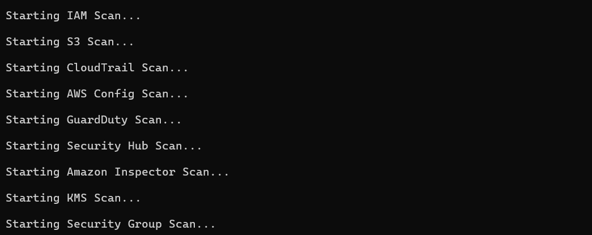
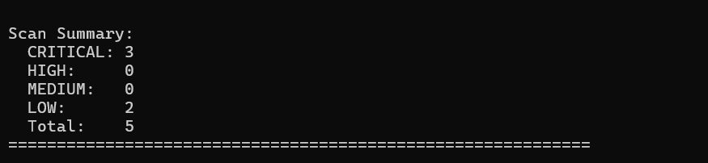
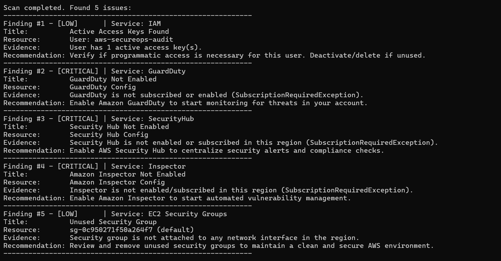

# AWS SecureOps

AWS SecureOps is an open-source, read-only AWS Cloud Security Posture Assessment framework written in Python using `boto3`. It is designed to be highly educational, lightweight, and easy to run. The tool audits your AWS infrastructure against security best practices and outputs clear, actionable findings directly to your console.

AWS SecureOps is being built in public. Every scanner is implemented after studying the underlying AWS service, understanding its security implications, and translating that knowledge into a practical security assessment.

---

## Screenshots

### Scanner execution output



### Findings summary



### Scan completed with findings



### Architecture diagram

```text
                      AWS Account
                         │
                AWS SecureOps Scanner
                         │
 ┌───────────────┬───────────────┬───────────────┐
 │               │               │               │
 IAM             S3          CloudTrail      Config
 │               │               │               │
 GuardDuty   Security Hub   Inspector        KMS
                         │
                  Security Groups
                         │
                    Findings Engine
                         │
                    Console Output

---
```
## Features

- **Strictly Read-Only**: Performs only read/describe operations. Never modifies any resources or configurations in your AWS account.
- **Console-friendly Output**: Displays findings color-coded by severity (CRITICAL, HIGH, MEDIUM, LOW) with clear evidence and direct recommendations.
- **Modular Design**: Scanners are separated by service, making the codebase highly educational and extensible.
- **Robust Exception Handling**: Gracefully handles `AccessDenied` or API errors on a per-resource level without failing the entire scan.

---

## Initial Release - v0.1.0

The framework contains security auditing modules for the following 9 AWS services:

- **IAM**: Audits active access keys, root user logins, and MFA status.
- **S3**: Inspects bucket public access configurations, SSL enforcement policies, and default encryption.
- **CloudTrail**: Checks trail statuses and multi-region organization logging configurations.
- **AWS Config**: Checks if configuration recording is active.
- **GuardDuty**: Checks if GuardDuty is active.
- **Security Hub**: Checks if Security Hub is active.
- **Amazon Inspector**: Verifies Inspector subscription status.
- **AWS KMS**: Audits customer-managed key policies, rotations, and status.
- **EC2 Security Groups**: Audits exposed management ports (SSH/22, RDP/3389), database ports, open protocols, and detects unused security groups.

---

## Architecture

The project has a flat and straightforward design tailored for learning and fast audit execution:

```text
secureops/
├── core/
│   └── aws_session.py        # Connects to AWS using the specified profile
├── scanners/                 # Individual service scanners
│   ├── cloudtrail_scanner.py
│   ├── config_scanner.py
│   ├── guardduty_scanner.py
│   ├── iam_scanner.py
│   ├── inspector_scanner.py
│   ├── kms_scanner.py
│   ├── s3_scanner.py
│   ├── securitygroup_scanner.py
│   └── securityhub_scanner.py
└── main.py                   # Main script orchestrating all scans
```

---

## Requirements

- Python 3.8+
- Active AWS account
- Configured AWS CLI profile with read-only security permissions

---

## AWS IAM Permissions

To run the full suite of scanners, your IAM identity needs the following read-only permissions:

```json
{
    "Version": "2012-10-17",
    "Statement": [
        {
            "Effect": "Allow",
            "Action": [
                "iam:Get*",
                "iam:List*",
                "iam:GenerateCredentialReport",
                "s3:GetBucketPublicAccessBlock",
                "s3:GetBucketEncryption",
                "s3:GetBucketPolicy",
                "s3:ListAllMyBuckets",
                "cloudtrail:DescribeTrails",
                "cloudtrail:GetTrailStatus",
                "config:DescribeConfigurationRecorders",
                "config:DescribeConfigurationRecorderStatus",
                "guardduty:ListDetectors",
                "securityhub:DescribeHub",
                "inspector2:GetConfiguration",
                "kms:ListKeys",
                "kms:DescribeKey",
                "kms:GetKeyRotationStatus",
                "kms:GetKeyPolicy",
                "ec2:DescribeSecurityGroups",
                "ec2:DescribeNetworkInterfaces"
            ],
            "Resource": "*"
        }
    ]
}
```

---

## Installation

1. **Clone the repository**:
   ```bash
   git clone https://github.com/yourusername/aws-secureops.git
   cd aws-secureops
   ```

2. **Create and activate a virtual environment**:
   ```bash
   python -m venv .venv
   # Windows:
   .venv\Scripts\activate
   # macOS/Linux:
   source .venv/bin/activate
   ```

3. **Install dependencies**:
   ```bash
   pip install -r requirements.txt
   ```

---

## Usage

Configure your target AWS CLI profile (default profile name used is `secureops`):

```bash
aws configure --profile secureops
```

Run the orchestrator:
```bash
python secureops/main.py
```

---

## Example Console Output

```text
============================================================
 AWS SecureOps - Posture Scanner
============================================================

[+] Successfully connected to AWS!
    Account:  123456789012
    Arn:      arn:aws:iam::123456789012:user/aws-secureops-audit

Starting IAM Scan...
Starting S3 Scan...
Starting CloudTrail Scan...
Starting AWS Config Scan...
Starting GuardDuty Scan...
Starting Security Hub Scan...
Starting Amazon Inspector Scan...
Starting KMS Scan...
Starting Security Group Scan...

Scan completed. Found 2 issues:
------------------------------------------------------------
Finding #1 - [CRITICAL] | Service: GuardDuty
Title:          GuardDuty Not Enabled
Resource:       GuardDuty Config
Evidence:       GuardDuty is not subscribed or enabled (SubscriptionRequiredException).
Recommendation: Enable Amazon GuardDuty to start monitoring for threats in your account.
------------------------------------------------------------
Finding #2 - [LOW]      | Service: EC2 Security Groups
Title:          Unused Security Group
Resource:       sg-0c950271f50a264f7 (default)
Evidence:       Security group is not attached to any network interface in the region.
Recommendation: Review and remove unused security groups to maintain a clean and secure AWS environment.
------------------------------------------------------------

Scan Summary:
  CRITICAL: 1
  HIGH:     0
  MEDIUM:   0
  LOW:      1
  Total:    2
============================================================
```

---

## Project Philosophy

- **Simplicity Over Abstraction**: We avoid complex plugin frameworks. Anyone who knows basic Python can inspect a single file in `scanners/` and understand how the security checks operate.
- **Actionable Advice**: Every security finding must tell the user why it was triggered (Evidence) and how to fix it (Recommendation).
- **Safety First**: As a rule, this tool does not modify code, policies, or cloud resources.

---

## Future Roadmap

For details on upcoming scanners (EBS, RDS, Secrets Manager, etc.) and reporting extensions (JSON, HTML, PDF exports), see [PROJECT_ROADMAP.md](file:///d:/Projects/AWS%20Secure%20OPS%20project/docs/PROJECT_ROADMAP.md).

---

## Contribution Guidelines

Contributions are welcome! Please read [CONTRIBUTING.md](file:///d:/Projects/AWS%20Secure%20OPS%20project/CONTRIBUTING.md) to learn how to add new scanning checks or modules.

---

## License

This project is licensed under the MIT License - see the [LICENSE](file:///d:/Projects/AWS%20Secure%20OPS%20project/LICENSE) file for details.

---

## Educational Disclaimer

> [!WARNING]
> AWS SecureOps is designed as an educational posture auditing utility. It is not an official auditing tool and does not guarantee compliance with any standard or certify security completeness. Always verify scanner results against the official AWS Management Console or AWS CLI.
