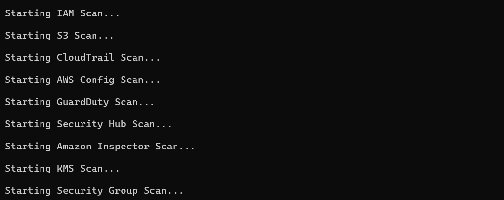
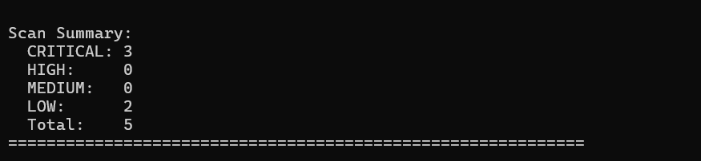
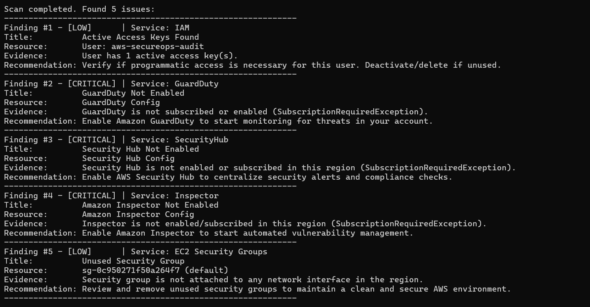

# AWS SecureOps

AWS SecureOps is an open-source, **read-only** AWS cloud security posture assessment tool written in Python using `boto3`. It calls only read/describe/list/get AWS APIs, never modifies AWS resources, and outputs clear, actionable findings to your console and, optionally, to a JSON report.

AWS SecureOps is being built in public. Every scanner is implemented after studying the underlying AWS service, understanding its security implications, and translating that knowledge into a practical, read-only security assessment check.

---

## Why AWS SecureOps?

AWS SecureOps was created to bridge the gap between learning AWS security concepts and implementing them in real-world security tooling.

Most open-source cloud security tools focus only on producing findings. AWS SecureOps focuses on both education and practical cloud security engineering — every scanner is implemented only after studying the AWS service and its security implications.

---

## Screenshots

### Scanner execution output



### Findings summary



### Scan completed with findings



> These screenshots were captured from an earlier tool version and show a partial scanner list. See [Example Console Output](#example-console-output) below for the current v0.2.0 output shape.

### Architecture (high level)

```text
CLI / secureops/main.py
        |
   AWS session (boto3, standard credential chain)
        |
 read-only scanners (IAM, S3, CloudTrail, Config, GuardDuty,
 Security Hub, Inspector, KMS, EC2 Security Groups, EC2/EBS)
        |
   Finding objects
        |
  console summary
        |
 posture scoring / assessment coverage
        |
  optional JSON report export
```

See [Architecture](#architecture) below for the full module breakdown.

## Features

- **Strictly Read-Only**: Performs only read/describe/list/get operations. Never modifies any resources or configurations in your AWS account.
- **Console-friendly Output**: Displays findings by severity (CRITICAL, HIGH, MEDIUM, LOW, INFO) with clear evidence and direct recommendations.
- **Modular Design**: Scanners are separated by service, making the codebase easy to read and extend.
- **Robust Exception Handling**: Gracefully handles `AccessDenied` and other API errors on a per-check basis without failing the entire scan, and never prints raw AWS exception text, account IDs, ARNs, or credentials.
- **Optional JSON Report Export**: Write a sanitized, structured JSON report to a local file with `--output-json`.
- **Posture Risk Score**: A simple, transparent, severity-weighted score (0–100) computed only from observed posture findings.
- **Assessment Coverage Status**: Tracks whether any scanner was blocked by a permission or execution error, separately from the risk score.

---

## Capabilities (v0.2.0)

### Core AWS posture checks

- **IAM**: Root account MFA status, IAM user console-MFA status, active access key exposure/age, directly-attached `AdministratorAccess` policies.
- **S3**: Bucket public access block configuration, default encryption, versioning, and bucket policy public-access status.
- **CloudTrail**: Trail existence, logging status, and multi-region trail configuration.
- **AWS Config**: Configuration recorder and delivery channel status.
- **GuardDuty**: Detector enablement and active finding visibility.
- **Security Hub**: Hub enablement and active finding visibility.
- **Amazon Inspector**: Account subscription/enablement status.
- **KMS**: Customer-managed key state (disabled / pending deletion) and key rotation status. *(AWS SecureOps does not inspect KMS key policies — see [KMS scope](#kms-scope) below.)*
- **EC2 Security Groups**: Exposed management ports (SSH/22, RDP/3389), database ports, all-traffic (`-1`) rules, and unused security groups.

### v0.2.0 additions

- **EC2 instances**: Running instances with a public IPv4 address are flagged as a posture signal (not a confirmed compromise or exposure — see below).
- **IMDSv2 enforcement**: Flags EC2 instances where `MetadataOptions.HttpTokens` is not `"required"` (including when metadata options are unavailable).
- **EBS encryption-at-rest**: Flags EBS volumes where `Encrypted` is `false`.
- **Communications-aware security-group exposure checks**:
  - SIP (port 5060, TCP/UDP) exposed to `0.0.0.0/0`/`::/0`
  - SIP-TLS (port 5061, TCP) exposed to `0.0.0.0/0`/`::/0`
  - Broad public UDP port ranges (≥1000 ports) exposed to `0.0.0.0/0`/`::/0`

  **Important**: these checks flag security-group *exposure* only. An open port range does not prove that a SIP, RTP, or other communications service is actually running, misconfigured, or exploitable — always confirm against the actual workload before treating this as a confirmed issue.
- **JSON report export** (`--output-json PATH`): a sanitized, structured report you can pipe into other tooling.
- **Posture risk score**: a simple, transparent, severity-weighted score, bounded 0–100. It sums fixed severity weights (CRITICAL=10, HIGH=7, MEDIUM=4, LOW=1, INFO=0) across posture findings only, capped at 100. Scanner/permission errors are excluded from the score entirely, so a blocked check can never inflate or deflate it. **This is not a compliance score, a certification, or a prediction of breach/compromise likelihood** — it is a simple prioritization signal.
- **Assessment coverage status**: `COMPLETE` if every scanner ran without a permission/execution error, otherwise `DEGRADED`, plus a `coverage_issue_count`. Coverage issues are tracked separately from posture risk so that missing access is visible but never silently changes the score.
- **Sanitized synthetic example report**: see [docs/examples/README.md](docs/examples/README.md) and the synthetic JSON example at [docs/examples/aws-secureops-demo-report.json](docs/examples/aws-secureops-demo-report.json) — entirely fabricated data, generated through the real reporting/scoring code, containing no real AWS account information.

### Future / planned (not yet implemented)

See [docs/PROJECT_ROADMAP.md](docs/PROJECT_ROADMAP.md) for the full list — e.g. multi-region orchestration, structured check identifiers, configurable scoring weights, finding suppression, HTML reporting, and additional AWS service coverage.

---

## Architecture

The project has a flat, straightforward design:

```text
secureops/
├── core/
│   ├── aws_session.py   # boto3 session creation via the standard credential chain
│   ├── models.py        # Finding dataclass (typed, frozen)
│   ├── errors.py        # create_permission_finding() / sanitize_error() - safe, sanitized error findings
│   ├── scoring.py        # calculate_assessment() - posture risk score + coverage status
│   ├── reporting.py      # build_json_report() / write_json_report() - JSON export
│   └── version.py        # AWS_SECUREOPS_VERSION constant
├── scanners/              # One module per AWS service, each exposing scan_<service>(session) -> list[Finding]
│   ├── iam_scanner.py
│   ├── s3_scanner.py
│   ├── cloudtrail_scanner.py
│   ├── config_scanner.py
│   ├── guardduty_scanner.py
│   ├── securityhub_scanner.py
│   ├── inspector_scanner.py
│   ├── kms_scanner.py
│   ├── securitygroup_scanner.py   # security groups, including communications-aware exposure checks
│   └── ec2_scanner.py             # EC2 instance public-IP/IMDSv2 + EBS encryption checks
└── main.py                # CLI entry point: orchestrates scans, console output, scoring, JSON export
```

Data flow:

```text
CLI (main.py)
    -> AWS session (core/aws_session.py)
    -> each scanner runs read-only boto3 calls and returns list[Finding]
    -> all findings are concatenated
    -> console summary (severity counts)
    -> posture scoring / coverage status (core/scoring.py)
    -> optional JSON report (core/reporting.py), if --output-json is passed
```

There is no plugin system, async orchestration, database, web UI, API server, or remediation engine — scanners are plain Python functions that call read-only `boto3` APIs and return `Finding` objects.

### Architectural Principles

* **Finding Dataclass**: A typed, frozen structure representing a single observation. Avoids messy dictionaries and enforces consistent output across all scanners.
* **Read-Only Philosophy**: The framework executes only non-destructive API queries (`Describe*`, `List*`, `Get*`, `BatchGet*`). It never creates, deletes, or alters AWS resources.
* **Modular Scanner Design**: Each AWS service has a dedicated module under `scanners/` containing its posture checks.
* **Sanitized Error Handling**: Permission and execution errors are converted into standardized `Finding` objects via `core/errors.py` — raw AWS exception text, request IDs, HTTP metadata, account IDs, and ARNs are never surfaced.
* **Unit Testing Approach**: Tests use botocore's `Stubber` to validate scanner behavior against mock AWS responses, without live network access or real credentials.

<a name="kms-scope"></a>
### KMS scope

The KMS scanner (`kms_scanner.py`) currently checks only:
- customer-managed key **state** (disabled / pending deletion), and
- customer-managed key **rotation status**.

It does **not** inspect or evaluate KMS key policies, grants, or cross-account access. Any earlier documentation suggesting key-policy auditing was inaccurate and has been corrected here.

---

## Requirements

- Python 3.10+ (uses PEP 604 union type hints, e.g. `str | None`)
- Active AWS account
- Configured AWS credentials (standard boto3 credential chain)

---

## AWS IAM Permissions

The permissions below were derived directly from the AWS SDK (`boto3`) calls actually present in the current scanner source files — not carried over from earlier drafts. Grant only these least-privilege, read-only actions:

```json
{
    "Version": "2012-10-17",
    "Statement": [
        {
            "Effect": "Allow",
            "Action": [
                "sts:GetCallerIdentity",

                "iam:GetAccountSummary",
                "iam:ListUsers",
                "iam:GetLoginProfile",
                "iam:ListMFADevices",
                "iam:ListAccessKeys",
                "iam:ListAttachedUserPolicies",

                "s3:ListAllMyBuckets",
                "s3:GetBucketPublicAccessBlock",
                "s3:GetEncryptionConfiguration",
                "s3:GetBucketVersioning",
                "s3:GetBucketPolicyStatus",

                "cloudtrail:DescribeTrails",
                "cloudtrail:GetTrailStatus",

                "config:DescribeConfigurationRecorders",
                "config:DescribeConfigurationRecorderStatus",
                "config:DescribeDeliveryChannels",

                "guardduty:ListDetectors",
                "guardduty:ListFindings",
                "guardduty:GetFindings",

                "securityhub:DescribeHub",
                "securityhub:GetFindings",

                "inspector2:BatchGetAccountStatus",
                "inspector2:ListFindings",

                "kms:ListKeys",
                "kms:DescribeKey",
                "kms:GetKeyRotationStatus",

                "ec2:DescribeSecurityGroups",
                "ec2:DescribeNetworkInterfaces",
                "ec2:DescribeInstances",
                "ec2:DescribeVolumes"
            ],
            "Resource": "*"
        }
    ]
}
```

Notes:
- `sts:GetCallerIdentity` is required both for the CLI's initial credential check and by the Inspector scanner (to resolve the current account for `BatchGetAccountStatus`).
- No write, modify, create, delete, or `*:*`-style wildcard actions are included anywhere.
- Some scanners (GuardDuty, Security Hub, Amazon Inspector, AWS Config) require the corresponding AWS service to be **enabled and configured** in the target account/region for their checks to produce meaningful findings rather than "not enabled" results. This is an AWS service-configuration matter, not a permissions issue.

---

## Installation

1. **Clone the repository**:
   ```bash
   git clone https://github.com/destro99912/aws-secureops.git
   cd aws-secureops
   ```

2. **Create and activate a virtual environment**:
   ```bash
   python -m venv .venv
   # Windows:
   .venv\Scripts\activate
   # macOS/Linux:
   source .venv/bin/activate
   ```

3. **Install dependencies**:
   * For standard runtime execution:
     ```bash
     pip install -r requirements.txt
     ```
   * For testing and development checks:
     ```bash
     pip install -r requirements-dev.txt
     ```

---

## Usage

AWS SecureOps utilizes boto3's standard credential provider chain. If no arguments are passed, it automatically resolves credentials from environment variables (`AWS_PROFILE`, `AWS_ACCESS_KEY_ID`, etc.), instance profiles, or shared configuration files.

Run the tool as a module — `python -m secureops.main` is the supported invocation (direct script invocation such as `python secureops/main.py` does not work with this project's package-qualified imports):

```bash
# Run using standard credential resolution chain:
python -m secureops.main

# Run targeting an explicit AWS region:
python -m secureops.main --region us-east-1

# Run targeting an explicit AWS profile:
python -m secureops.main --profile secureops

# Run targeting both explicit profile and region:
python -m secureops.main --profile secureops --region us-east-1

# Write a sanitized JSON report to a local file in addition to console output:
python -m secureops.main --output-json report.json
```

---

## Example Console Output

```text
============================================================
 AWS SecureOps - Posture Scanner
============================================================

[+] Successfully authenticated to AWS.

Starting IAM Scan...
Starting S3 Scan...
Starting CloudTrail Scan...
Starting AWS Config Scan...
Starting GuardDuty Scan...
Starting Security Hub Scan...
Starting Amazon Inspector Scan...
Starting KMS Scan...
Starting Security Group Scan...
Starting EC2 Scan...

Scan completed. Found 2 issues:
------------------------------------------------------------
Finding #1 - [CRITICAL] | Service: GuardDuty
Title:          GuardDuty Not Enabled
Resource:       GuardDuty Config
Evidence:       GuardDuty is not subscribed or enabled (SubscriptionRequiredException).
Recommendation: Enable Amazon GuardDuty to start monitoring for threats in your account.
------------------------------------------------------------
Finding #2 - [LOW]      | Service: EC2 Security Groups
Title:          Unused Security Group
Resource:       sg-demo-001 (default)
Evidence:       Security group is not attached to any network interface in the region.
Recommendation: Review and remove unused security groups to maintain a clean and secure AWS environment.
------------------------------------------------------------

Scan Summary:
  CRITICAL: 1
  HIGH:     0
  MEDIUM:   0
  LOW:      1
  INFO:     0
  Total:    2
============================================================

Posture Assessment:
  Risk Score:        11/100
  Risk Level:        LOW
  Coverage Status:   COMPLETE
  Coverage Issues:   0
```

See [docs/examples/README.md](docs/examples/README.md) for a full, synthetic example JSON report (`docs/examples/aws-secureops-demo-report.json`) generated through the real reporting/scoring code.

---

## Project Philosophy

- **Simplicity Over Abstraction**: No complex plugin frameworks. Anyone who knows basic Python can inspect a single file in `scanners/` and understand how the security checks operate.
- **Actionable Advice**: Every security finding tells the user why it was triggered (Evidence) and how to address it (Recommendation).
- **Safety First**: This tool does not modify AWS resources, policies, or configuration under any circumstance.
- **Cautious Language**: Findings describe observed configuration state, not confirmed compromise, exploitability, or compliance status.

---

## Future Roadmap

For upcoming scanners and reporting extensions, see [docs/PROJECT_ROADMAP.md](docs/PROJECT_ROADMAP.md).

---

## Contribution Guidelines

Contributions are welcome! Please read [CONTRIBUTING.md](CONTRIBUTING.md) to learn how to add new scanning checks or modules.

---

## License

This project is licensed under the MIT License - see the [LICENSE](LICENSE) file for details.

---

## Educational Disclaimer

> [!WARNING]
> AWS SecureOps is a read-only AWS cloud security posture assessment tool. It is not an official auditing tool, does not perform or claim any compliance certification (including CIS conformance), does not detect breaches, and does not predict exploitability. Findings describe observed configuration state only. Always verify results against the official AWS Management Console or AWS CLI before acting on them.

---

## Recommended GitHub Repository Settings

**Repository Description**:
An open-source, read-only AWS cloud security posture assessment tool built with Python and boto3.

**Suggested GitHub Topics**:
`aws`, `aws-security`, `cloud-security`, `boto3`, `python`, `devsecops`, `security`, `opensource`, `aws-config`, `guardduty`, `securityhub`, `cloud`
